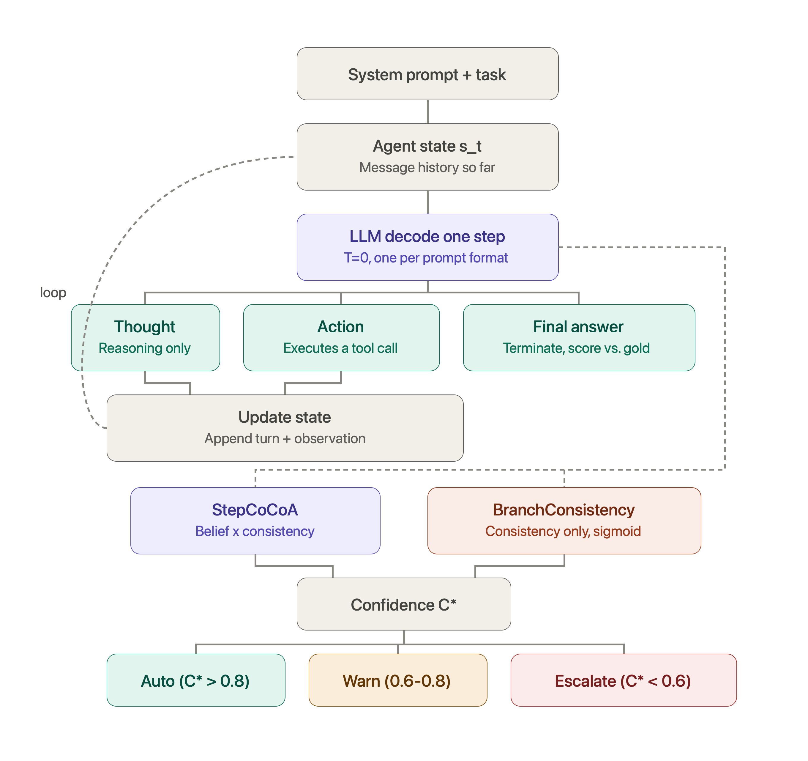

# Calibrated Agency

**Mitigation of Error Propagation in Tool-Based LLM Agents through Hybrid Uncertainty Quantification**

Master's Thesis — Christian Hobelsberger

---

## Overview

This repository implements the experimental setup for the *Calibrated Agency* thesis,
which extends the CoCoA (Confidence-Consistency Aggregation) framework from static
question-answering to **step-level uncertainty quantification in tool-based LLM agents**,
aiming to detect hallucination snowballing before an agent commits to an irreversible
tool call.

The core contribution, **StepCoCoA**, fuses at each step *t*:
- **Belief term** `u_belief`: negative log-probability of the greedy action
- **Consistency term** `u_cons`: semantic dissimilarity across M=5 stochastically sampled
  alternatives (temperature 0.7, top-p 0.9), scored with a RoBERTa-large NLI cross-encoder
  (`cross-encoder/nli-roberta-base`)

into a step-level confidence score `C*(a_t | s_t) = 1 - normalize(u_belief · u_cons) ∈ [0,1]`
that gates a three-tier escalation policy at each pre-tool-call decision point:

| Policy | Condition | Meaning |
|---|---|---|
| **Auto**     | `C* > lambda_auto` (0.8)                        | Execute without review |
| **Warn**     | `lambda_snow ≤ C* ≤ lambda_auto` (0.6–0.8)       | Execute, flag for review |
| **Escalate** | `C* < lambda_snow` (0.6)                        | Halt, request human input |

`lambda_snow`/`lambda_auto` are fixed thresholds inherited from prior work, **not** tuned
per-benchmark in the reported results (that's flagged future work).

Concretely, this scoring sits alongside the agent's own ReAct step loop (decode, act,
observe, repeat) as a parallel process that watches every step before committing to it:



*Figure: agent execution loop with the parallel uncertainty estimation and escalation
pipeline. From state `s_t`, the model decodes one step: a thought, an action, or a final
answer. That updates the state and loops back (thought, action) or ends the trajectory
(final answer). In parallel (dashed), StepCoCoA and BranchConsistency independently score
the step and feed a shared confidence `C*`, which sets the escalation tier.*

---

## Final scope

**Three benchmarks** (50/50 calibration/test split each):

| Benchmark | Type | Tool | N (calib/test) |
|---|---|---|---|
| GSM8K | Multi-step arithmetic QA | Calculator (MCP) | 500 (250/250) |
| AgentBench-DB | Interactive SQL | SQLite (MCP) | 360 (180/180) |
| HotpotQA | Multi-hop open-domain QA | search / lookup / finish | 500 (250/250) |

**Two models**: Llama-3.1-8B-Instruct, Llama-3.1-70B-Instruct.

**Four reported UQ estimators**:

| Estimator | Level | Requires logits | Description |
|---|---|---|---|
| **StepCoCoA** | Step | Yes | Belief × consistency (multiplicative) |
| **BranchConsistency** | Step | No | Consistency only, sigmoid-normalized NLI logits |
| **MSP-Answer** | Answer (final step) | Yes | Maximum softmax probability baseline |
| **CoCoA-Answer** | Answer (final step) | Yes | CoCoA baseline |

**Aggregation strategies** (trajectory-level, from step confidences): `min` and `mean` are
reported. `ema` (exponential moving average, alpha=0.7) is defined in the Methods section,
but no final table uses it; see `uq/stepwise_cocoa.py`.

**Metrics** (all trajectory-level; no step-level heuristic label is ever used for a
reported metric — heuristic step-level annotation in `uq/annotation.py` exists only for
qualitative failure-mode illustration): ACC, ECE, AUROC, SelAcc@0.8, Cov@0.8, TR (trigger
rate), PPV, FER (false escalation rate), Lift = PPV / fail_rate.

**Not in the final scope**: AgentBench-OS (bash/Docker interaction) and
"BranchConsistency-raw" (a quantile-clip normalized ablation of BranchConsistency; never
treat it as a reported method) were both evaluated during experimentation and dropped
from the thesis. This code still exists, clearly isolated, under
[`legacy/`](legacy/README.md) or inline behind non-default flags; see
[`legacy/README.md`](legacy/README.md) for what's there and why.

---

## Quick Start

```bash
# 1. Set up environment (LRZ cluster)
bash scripts/lrz/setup_env.sh

# OR on any Linux machine with CUDA 12.6:
python -m venv venv && source venv/bin/activate
pip install torch==2.4.0 --index-url https://download.pytorch.org/whl/cu126
pip install -r requirements.txt

# 2. Configure credentials
cp .env.example .env
# Edit .env: set HF_TOKEN=hf_...

# 3. Prepare datasets (the three final benchmarks by default)
python scripts/prepare_datasets.py

# 4. Run an experiment (see "Reproducing the thesis results" below for the exact
#    commands used to produce the reported numbers)
python -m experiments.gsm8k_agent --n-samples 50 --split-phase full   # quick pilot
```

---

## Reproducing the thesis results

Experiments were run directly via each benchmark's CLI module (not through a combined
runner script), then evaluated via the analysis notebooks. `<MODEL_DIR>` is your local
Llama-3.1 weights directory (e.g. `$LRZ_MODEL_DIR` on the LRZ cluster, see
`.env.example`). For the 70B model, use `--tensor-parallel-size 2` (8B uses 1).

```bash
# GSM8K — N=500
python -m experiments.gsm8k_agent \
  --model <MODEL_DIR>/Llama-3.1-8B-Instruct \
  --n-samples 500 --output-dir results/gsm8k_8B_500_split_50-50 --split-phase full \
  --cocoa-m 5 --branch-m 5 --temperature 0.7 --tensor-parallel-size 1 --calib-ratio 0.5

# AgentBench-DB — N=360
python -m experiments.agentbench_agent \
  --model <MODEL_DIR>/Llama-3.1-8B-Instruct \
  --env-type db --n-samples 360 --output-dir results/agentbench_db_8B_full_split_50-50 \
  --split-phase full --dataset-mode full --cocoa-m 5 --branch-m 5 --temperature 0.7 \
  --tensor-parallel-size 1 --calib-ratio 0.5

# HotpotQA — N=500
python -m experiments.hotpotqa_agent \
  --model <MODEL_DIR>/Llama-3.1-8B-Instruct \
  --n-samples 500 --output-dir results/hotpotqa_8B_500_full_split_50-50 --split-phase full \
  --cocoa-m 5 --branch-m 5 --temperature 0.7 --tensor-parallel-size 1 --calib-ratio 0.5
```

Swap `--model`/`--tensor-parallel-size` for the 70B model to get the 70B results.

### Which script/notebook produces which thesis output

| Notebook / script | Produces |
|---|---|
| [`scripts/prepare_datasets.py`](scripts/prepare_datasets.py) | Prepares `data/<benchmark>/` JSONL files |
| [`notebooks/dataset_analysis.ipynb`](notebooks/dataset_analysis.ipynb) | Dataset statistics for thesis Chapter 4.2 |
| [`scripts/normalize_branch_consistency.py`](scripts/normalize_branch_consistency.py) | Post-hoc sigmoid-normalizes `branch_consistency` in raw trajectory JSONL |
| [`notebooks/comprehensive_results_analysis.ipynb`](notebooks/comprehensive_results_analysis.ipynb) | **Master results notebook**: core metrics table, reliability diagrams, selective prediction curves, 8B-vs-70B scaling, snowball/early-warning analysis, LaTeX table export, final paper figures |

`notebooks/baseline_replication_proper_split.ipynb` is a per-experiment diagnostic
deep-dive (not a source of any final reported table/figure).

---

## Directory Structure

```
calibrated_agency/
│
├── agent/                          # LLM inference layer
│   ├── instrumented_agent.py       # InstrumentedVLLMModel + StepRecord
│   ├── cpu_local_model.py          # CPU/TinyLlama dev-only fallback
│   └── mcp_client.py               # MCPToolProvider (tool server client) + DirectCalculator
│
├── tools/                          # MCP server implementations
│   ├── calculator_server.py        # Safe arithmetic (GSM8K)
│   └── sqlite_server.py            # SQLite read/write (AgentBench-DB)
│
├── uq/                             # Uncertainty quantification layer
│   ├── stepwise_cocoa.py           # StepCoCoA
│   ├── branching.py                # BranchConsistency
│   ├── annotation.py               # Heuristic step-level labels (qualitative illustration only)
│   ├── evaluate.py                 # Trajectory-level ACC/ECE/AUROC/SelAcc/Cov, snowball detection (TR/PPV/FER)
│   └── baselines.py                # MSP-Answer, CoCoA-Answer (VCE-Answer kept as an excluded ablation)
│
├── experiments/                    # Experiment runners (final 3 benchmarks)
│   ├── gsm8k_agent.py              # GSM8K tool-augmented agent
│   ├── hotpotqa_agent.py           # HotpotQA multi-hop agent
│   └── agentbench_agent.py         # AgentBench-DB (final) + AgentBench-OS (excluded, kept inline)
│
├── notebooks/                      # Analysis notebooks
│   ├── dataset_analysis.ipynb
│   ├── baseline_replication_proper_split.ipynb
│   └── comprehensive_results_analysis.ipynb   # master results notebook
│
├── scripts/
│   ├── prepare_datasets.py         # Dataset prep (3 final benchmarks by default)
│   ├── analyze_baseline.py         # Single-results-dir diagnostic tool
│   ├── normalize_branch_consistency.py
│   ├── setup_agentbench.sh
│   ├── setup_lrz.sh
│   └── lrz/                        # LRZ cluster SLURM jobs + prereq checks
│
├── legacy/                         # Archived / excluded-from-final-scope code, see legacy/README.md
│
├── guides/                         # Workflow walkthroughs
├── results/                        # Auto-created; results/figures & results/examples are tracked in git,
│                                    # everything else (raw trajectory JSONL) is gitignored
│
├── config.py                       # Centralised configuration (all hyperparameters)
├── requirements.txt
└── .env.example
```

---

## Configuration

All hyperparameters live in [`config.py`](config.py):

```python
from config import DEFAULT_CONFIG

cfg = DEFAULT_CONFIG
cfg.uq.cocoa_m         # M samples for StepCoCoA (default: 5)
cfg.uq.branch_m        # M alternatives for BranchConsistency (default: 5)
cfg.uq.threshold_warn  # lambda_snow (default: 0.6)
cfg.uq.threshold_auto  # lambda_auto (default: 0.8)
cfg.experiment.split_calib  # calibration split fraction (default: 0.5)
```

